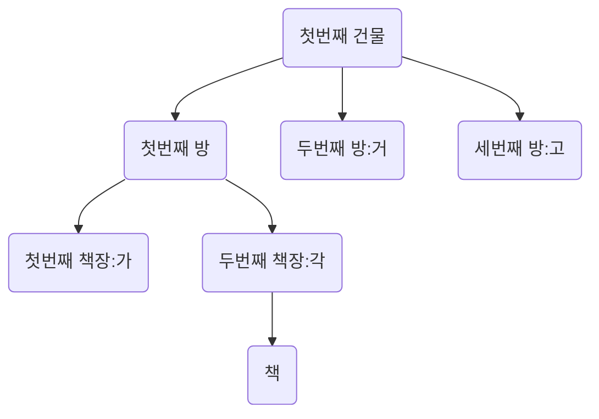

# Index

- 색인

## 얻을 수 있는 장점

- MySQL이 데이터를 빠르게 찾기 위해서
  - SELECT가 빨라진다.

```sql
SELECT * FROM board WHERE id=1;
```

## 단점

- 무거워진다. => SELECT 이외의 DML이 느려진다.
- 용량을 더 차지한다 => 약 10% 더먹는다.

## Index를 설정하면

- 설정에 맞춰서 목록을 생성

# 왜 쓸까?

- 왜 빨리 찾아야할까?

| num | name   |
| --- | ------ |
| 1   | 김강문 |
| 2   | 박성민 |
| 3   | 방지완 |

# Index를 자동으로 해주는 키

- UNIQUE
- PRIMARY KEY
- FOREIGN KEY

# Index는 어떻게 빠르게 찾을 수 있는가? 목록화를 어떻게 하는가?

## 자료구조

- 순서대로 정리한다.
- 가나다 순으로 책을 정리한다.
- 첫번째 건물 : ㄱ => 100만권
  - 첫번째 방 : 가 => 100만권
    - 첫번째 책장 : 가
    - 두번째 책장 : 각
  - 두번째 방 : 거
  - 세번째 방 : 고
- 두번째 건물 : ㄴ

### B-Tree



## CREATE INDEX

```SQL
CREATE INDEX idx_category_id ON category_test (category_id ASC)
CREATE INDEX idx_board_title ON board_test(title DESC);

- ASC : 오름차순
- DESC : 내림차순
```

# SHOW INDEX

```sql
SHOW INDEX FROM board_test;
```

## DROP INDEX

```sql
DROP INDEX idx_bobrd_title ON board_test;
```
