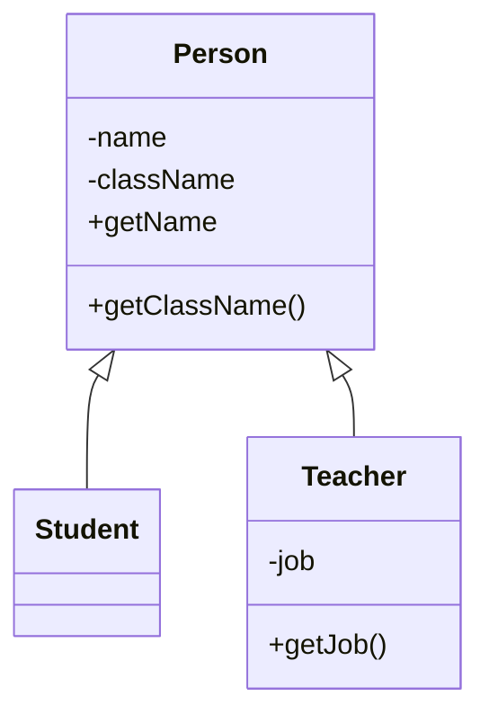

# Class Diagram

# 객체지향 OOP

- SOLID

## S-SRP

- Single Resposiblility Principle
- 단일 책임 원칙
- 하나의 클래스는 하나의 기능을 갖는다.

## O-OCP

- open Closed Principle
- 개방-폐쇄 원칙
- 클래스는 변경에 있어서 닫혀있고 확장에 있어서 열려있어야 한다.

## L - LSP

- Liskov Substitution Principle
- 리스코프 치환 원칙
- 상위 타입은 하위 타입으로 대체되어도 정상 동작하여야한다.

## I - ISP

- Interface Segregation Principle
- 인터페이스 분리 원칙
- 인터페이스는 명확하게 나눠져야 한다.

## D - DIP

- Dependency Inversion Principle
- 의존 역전 원칙
- 의존 : 가져다 쓴다.
- Class를 가져다 쓴다. -> Interface를 가져다 써라.
