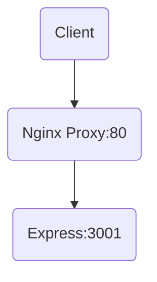

# Node.js BackEnd 배포

```bash
curl -o- https://raw.githubusercontent.com/nvm-sh/nvm/v0.39.7/install.sh | bash

source ~/.bashrc
nvm install --lts
node -v
npm -v
```

# 파일 업로드

```bash
cd /var/www
ls -al

# total 12
# drwxr-xr-x  3 root root 4096 Jun  5 00:21 .
# drwxr-xr-x 14 root root 4096 Jun  5 00:21 ..
# drwxr-xr-x  2 root root 4096 Jun  5 00:21 html

```

```bash
# /var/www
sudo chmod 777 html -R
ls -al

# total 12
# drwxr-xr-x  3 root root 4096 Jun  5 00:21 .
# drwxr-xr-x 14 root root 4096 Jun  5 00:21 ..
# drwxrwxrwx  2 root root 4096 Jun  5 00:21 html
```

```bash
sudo apt-get install mysql-server -y
sudo mysql -u root -p
```

```sql
ALTER USER 'root'@'localhost' IDENTIFIED WITH mysql_native_password BY '변경할비밀번호';

CREATE USER 'mayproject'@'localhost' IDENTIFIED WITH mysql_native_password BY '변경할비밀번호';
CREATE DATABASE mayproject;
GRANT ALL PRIVILEGES ON mayproject.* TO 'mayproject'@'localhost';
```

# Node 세팅

```bash
cd ~/server
npm i
```

맥 인스턴스 보안그룹
인바운드 규칙

# 서버를 정식으로 배포하기 위해서 백엔드에서 실행

- pm2 프레임워크를 사용

```bash
npm i pm2 -g
npm list -g # 노드 js자체에 설치(글로벌)
pm2 start server.js
pm2 list # 뭐가 켜져있는지 확인
pm2 stop 0 # pm2 stop id
pm2 delete 0 # pm2 delete id
```

cd /etc/nginx/sites-available
sudo vi default
location / {

}
location /api {
proxy_pass http://localhost:3001/api;
}
sudo service nginx restart



proxy : Client 가 보낸 요청을 다른 서버에 다시 요청을 보내준다.
응답에 대해서 다른 서버가 보내준 사실을 클라이언트가 알고있다.
C --요청 : 80 --> B --재요청 : 8080 --> A
A --응답 : 3001--> B --응답 : 80--> C
